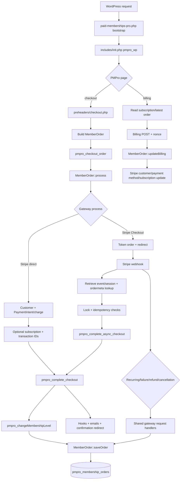

# Research: Analiza procesu przetwarzania płatności

**Date**: 2026-09-04T19:26:56+02:00  
**Researcher**: Codex  
**Git Commit**: `2b2c288021fd4bfbf15ce12c0304419cf12bf6c4`  
**Branch**: `10xdevs-m4`  
**Repository**: `paid-memberships-pro`

## Research Question

Przeanalizuj proces przetwarzania płatności, zwracając szczególną uwagę na powiązane z nim obszary zdefiniowane w `context/map/repo-map.md`. Analiza obejmuje ścieżkę E2E, luki w testach oraz blast radius zmiany, wyłącznie dla stanu obecnego repozytorium.

## Feature overview

Przepływ płatności jest rozproszony między bootstrapem pluginu, stronami checkout/billing, polimorficznym interfejsem gatewaya, `MemberOrder`, tabelami zamówień/subskrypcji oraz asynchronicznymi handlerami Stripe. Najważniejszy podział to:

- checkout bezpośredni: request → gateway `process()` → `pmpro_complete_checkout()` → zmiana członkostwa → `MemberOrder::saveOrder()` → `pmpro_membership_orders` → redirect;
- Stripe Checkout: utworzenie tokenowego zamówienia i redirect → webhook → odczyt order meta → uzupełnienie transakcji → `pmpro_complete_async_checkout()` → ta sama ścieżka finalizacji;
- recurring/failure/refund/cancellation: webhook → odczyt subskrypcji lub zamówienia → współdzielony handler płatności cyklicznej, zmiany statusu albo zwrotu;
- aktualizacja danych billingowych: odczyt subskrypcji i ostatniego zamówienia → `updateBilling()` → aktualizacja klienta/metody płatności/subskrypcji w gatewayu.

To potwierdza mapę repozytorium: największe ryzyko leży na granicach `classes/gateways` ↔ `services/stripe-webhook.php`, checkout/billing ↔ `MemberOrder` oraz PHP ↔ WordPress hooks/runtime.

## Podsumowanie

Bootstrap ładuje warstwy płatnicze w `paid-memberships-pro.php:30-179`, a `includes/init.php:60-102` kieruje żądania stron PMPro do właściwych preheaderów. Checkout tworzy i wzbogaca `MemberOrder` (`preheaders/checkout.php:586-620`), wywołuje gateway (`preheaders/checkout.php:624-656`, `classes/class.memberorder.php:1636-1641`), a po sukcesie finalizuje członkostwo i zapis zamówienia (`includes/checkout.php:220-347`).

Stripe ma dwa warianty checkoutu: bezpośredni PaymentIntent/charge oraz Stripe Checkout z asynchroniczną finalizacją przez webhook (`classes/gateways/class.pmprogateway_stripe.php:2220-2326`). Webhook jest rejestrowany jako WordPress AJAX endpoint (`includes/services.php:38-44`), potwierdza request przed dalszym przetwarzaniem (`services/class-pmpro-stripe-webhook-handler.php:128-131`), opcjonalnie kolejkuje zdarzenie przez Action Scheduler (`:149-185`) i routuje typ zdarzenia (`:206-236`).

W repozytorium nie znaleziono testów własnych dla tej ścieżki: brak katalogu `tests`, PHPUnit, Playwright, Cypress, Jest lub analogicznego oraz brak skryptu testowego w `package.json:10-25`. Wszystkie zidentyfikowane gałęzie checkoutu, webhooków, duplikatów i błędów są więc obecnie niepokryte testami repozytorium.

## Szczegółowe ustalenia

### 1. Ślad E2E — checkout i zapis zamówienia

1. `paid-memberships-pro.php:30-168` ładuje funkcje, `MemberOrder`, checkout, handlery żądań i usługi; Stripe jest ładowany w `:176-179`.
2. `includes/functions.php:3851-3872` rozpoznaje i waliduje aktywny gateway.
3. `includes/init.php:60-102` rozpoznaje stronę PMPro i uruchamia odpowiedni preheader.
4. `preheaders/checkout.php:586-620` buduje `MemberOrder` z danymi użytkownika, poziomu, danych billingowych, podatku, sum i gatewaya oraz uruchamia `pmpro_checkout_order`.
5. `preheaders/checkout.php:624-656` wywołuje `process()`; `classes/class.memberorder.php:1636-1641` deleguje do konkretnego gatewaya.
6. Bezpośredni wariant Stripe wykonuje operacje na kliencie/metodzie płatności, PaymentIntent/charge i opcjonalnej subskrypcji w `classes/gateways/class.pmprogateway_stripe.php:2232-2323`; zapisuje identyfikatory transakcji i status.
7. `includes/checkout.php:220-301` wywołuje `pmpro_changeMembershipLevel()`, oznacza order jako udany i finalizuje zapis.
8. `classes/class.memberorder.php:1395-1465` zapisuje status, gateway, identyfikatory transakcji, kwoty, dane billingowe i `checkout_id` do `pmpro_membership_orders`.
9. `includes/checkout.php:326-342` uruchamia hooki i e-maile; `preheaders/checkout.php:679-684` wykonuje przekierowanie na stronę potwierdzenia.

### 2. Ślad E2E — Stripe Checkout i webhook

Stripe Checkout tworzy tokenowe zamówienie i redirectuje użytkownika (`classes/gateways/class.pmprogateway_stripe.php:2220-2227`). Endpoint webhooka (`services/stripe-webhook.php:16-36`) parsuje `event_id` lub raw JSON i uruchamia handler.

Handler pobiera/weryfikuje zdarzenie (`services/class-pmpro-stripe-webhook-handler.php:30-126`), wysyła HTTP 200 (`:128-131`), a zdarzenia opóźnione kolejkuje (`:149-185`). Dla finalizacji sesji:

- `:492-509` pobiera sesję i odnajduje order przez `pmpro_membership_ordermeta`;
- `:511-590` uzupełnia transakcje, dane płatności i kwoty;
- `:803-887` pomija już przetworzone zamówienie, pobiera blokadę doradczą, ponownie czyta status i odzyskuje brakujący identyfikator transakcji jednorazowej;
- `:890-897` wywołuje `pmpro_complete_async_checkout()`;
- `includes/checkout.php:358-360` kieruje tę ścieżkę do wspólnego `pmpro_complete_checkout()`.

### 3. Pozostałe zdarzenia płatnicze

Router (`services/class-pmpro-stripe-webhook-handler.php:206-236`) prowadzi do:

- sukces płatności cyklicznej: `:246-276` → `pmpro_handle_recurring_payment_succeeded_at_gateway()`;
- błąd płatności: `:334-391` → `pmpro_handle_recurring_payment_failure_at_gateway()`;
- anulowanie: `:393-402`;
- zwrot: `:404-474`, odnalezienie po payment transaction ID, status `refunded`, notatka i `SaveOrder()`;
- finalizacja checkoutu oraz asynchroniczny sukces/błąd: `:492-656`;
- utworzenie/nadchodząca faktura: `:658-732`.

Wspólna warstwa płatności cyklicznych znajduje się w `includes/gateway-request-handlers.php:133-209` i `:224-305`. Obsługuje m.in. brak subskrypcji/użytkownika, duplikat udanej płatności, ponowne użycie oczekującego orderu, tworzenie nowego orderu oraz tłumienie kolejnych e-maili o błędzie.

### 4. Aktualizacja danych billingowych

`preheaders/billing.php:12-54` odczytuje subskrypcję i ostatni udany order albo tworzy tymczasowy, niezapisany `MemberOrder`. POST jest chroniony nonce (`:88-122`), dane są ustawiane i filtrowane (`:228-247`), a `updateBilling()` wywoływane w `:256-258`. `classes/class.memberorder.php:1674-1679` deleguje do gatewaya, a Stripe aktualizuje klienta, metodę płatności i subskrypcję (`classes/gateways/class.pmprogateway_stripe.php:2515-2573`).

Istotna granica: zwykła ścieżka aktualizacji danych billingowych nie wywołuje jawnie `saveOrder()`; dla tymczasowego orderu preheader wyraźnie zakłada brak zapisu (`preheaders/billing.php:43-54`).

### 5. Weryfikacja twierdzeń strukturalnych przez ast-grep

Poniższe wyniki dotyczą wzorców AST uruchomionych na kodzie PHP repozytorium. Liczności oznaczają dopasowania składni wywołania, nie dowodzą częstotliwości wykonania w runtime.

| Twierdzenie z raportu | Wzorzec ast-grep i wynik | Ocena | Dowód |
|---|---|---|---|
| Checkout wywołuje gatewayowe `process()`, a `MemberOrder` deleguje do gatewaya. | `$OBJ->process($$$)` → 2 dopasowania: preheader checkoutu i delegacja w `MemberOrder`; `function process($$$)` potwierdza implementacje gatewayów. | **potwierdzone** | `preheaders/checkout.php:629`; `classes/class.memberorder.php:1639`; kontrakt `classes/gateways/class.pmprogateway.php:16` i implementacje m.in. `classes/gateways/class.pmprogateway_stripe.php:2220`, `classes/gateways/class.pmprogateway_braintree.php:551`. |
| `pmpro_complete_async_checkout()` prowadzi do tej samej finalizacji co checkout synchroniczny. | `pmpro_complete_async_checkout($$$)` → 1 dopasowanie; definicja zwraca `pmpro_complete_checkout($order)`. | **potwierdzone** | `services/class-pmpro-stripe-webhook-handler.php:891`; `includes/checkout.php:358-359`. |
| `pmpro_complete_checkout()` jest wspólnym punktem finalizacji. | `pmpro_complete_checkout($$$)` → 2 dopasowania: zwykły preheader i wrapper async; definicja zawiera zapis orderu. | **potwierdzone** | `preheaders/checkout.php:679`; `includes/checkout.php:220`, `includes/checkout.php:301`, `includes/checkout.php:359`. |
| Zapis orderu jest elementem jednej ścieżki checkoutu / jest lokalizowany przy finalizacji checkoutu. | `$OBJ->saveOrder($$$)` → 27 dopasowań w produkcyjnym PHP, w tym webhooki wielu gatewayów, handlery cykliczne, admin i upgrade. | **obalone** | Przykłady poza checkoutem: `services/braintree-webhook.php:170`, `services/authnet-silent-post.php:150`, `includes/gateway-request-handlers.php:201`, `services/class-pmpro-stripe-webhook-handler.php:601`, `adminpages/orders.php:63`. Checkout ma dopasowania `includes/checkout.php:207`, `includes/checkout.php:301`. |
| Zwykła aktualizacja billingowa nie wywołuje jawnie `saveOrder()`. | `$OBJ->updateBilling($$$)` → 2 dopasowania; brak `saveOrder()` w `preheaders/billing.php`, ale istnieje osobna ścieżka webhooka Braintree. | **doprecyzowane** | `preheaders/billing.php:258` nie ma lokalnego zapisu; `services/braintree-webhook.php:465` wywołuje `updateBilling()`. Twierdzenie jest prawdziwe tylko dla orkiestracji billing preheadera, nie dla całego repozytorium. |
| Istnieją dwa synchroniczne warianty Stripe: direct i Stripe Checkout. | `function process($$$)` dla Stripe → `classes/gateways/class.pmprogateway_stripe.php:2220`; wzorzec async → `pmpro_complete_async_checkout($$$)` w handlerze webhooka. | **doprecyzowane** | Są dwa warianty checkoutu, ale Stripe Checkout jest wariantem asynchronicznej finalizacji: redirect `classes/gateways/class.pmprogateway_stripe.php:2220-2227`, webhook `services/class-pmpro-stripe-webhook-handler.php:891`, wspólna finalizacja `includes/checkout.php:358-359`. |
| Sukces i błąd płatności cyklicznej przechodzą przez współdzielone handlery. | Wzorce `pmpro_handle_recurring_payment_succeeded_at_gateway($$$)` i `...failure...($$$)` dają po 2 dopasowaniach: IPN i Stripe webhook. | **potwierdzone** | Sukces: `services/ipnhandler.php:709`, `services/class-pmpro-stripe-webhook-handler.php:267`; błąd: `services/ipnhandler.php:681`, `services/class-pmpro-stripe-webhook-handler.php:382`. |
| Stripe webhook ma jeden publiczny AJAX endpoint dostępny dla zalogowanych i niezalogowanych. | Wzorce `add_action(...)` dla `wp_ajax_nopriv_stripe_webhook` i `wp_ajax_stripe_webhook` → po jednym hooku każdego typu, oba wskazują tę samą funkcję. | **potwierdzone** | `includes/services.php:38-44`. |
| Kontrakt gatewaya obejmuje pojedynczy wspólny kształt metod `process()` i `cancel()`. | `function process($$$)` oraz `function cancel($$$)` pokazują bazowy kontrakt i wiele implementacji; sygnatury nie są całkowicie jednolite (np. Stripe ma dodatkowy parametr w `cancel`). | **doprecyzowane** | Bazowe metody: `classes/gateways/class.pmprogateway.php:16`, `classes/gateways/class.pmprogateway.php:110`; Stripe: `classes/gateways/class.pmprogateway_stripe.php:2220`, `classes/gateways/class.pmprogateway_stripe.php:2580`; inne implementacje np. `classes/gateways/class.pmprogateway_check.php:313`, `:443`. |
| Schemat trwałości jest utrzymywany przez `dbDelta()`, z wieloma definicjami tabel. | `dbDelta($$$)` → 16 dopasowań łącznie; 15 w `includes/upgradecheck.php` i 1 w dołączonym Action Scheduler. | **potwierdzone** | `includes/upgradecheck.php:523-807`; dodatkowe dopasowanie `includes/lib/action-scheduler/classes/abstracts/ActionScheduler_Abstract_Schema.php:143`. |

Wzorce nie potwierdzają twierdzeń o zachowaniu runtime, kolejności hooków, liczbie wykonań ani kompletności testów. Dla tych tez raport pozostawia wnioski oparte na odrębnych dowodach statycznych lub oznacza krawędzie WordPress/runtime jako `unknown`.

### 6. Diagram przepływu

## Luki w pokryciu testami

Repozytorium nie ma automatycznych testów własnych dla opisanej ścieżki. `package.json:4-7` wskazuje katalog `tests`, którego nie ma, `package.json:10-25` nie zawiera skryptu testowego, a `composer.json:1-39` nie zawiera zależności ani konfiguracji PHPUnit.

Uncovered production branches include:

- Stripe Checkout redirect, existing PaymentIntent confirmation, PaymentIntent/charge failure, customer/payment-method creation and attachment exceptions, subscription creation failure, and final transaction/status assignment (`classes/gateways/class.pmprogateway_stripe.php:2220-2326`);
- checkout processing failure, membership assignment failure, gateway cancellation after assignment failure and confirmation/error fallback (`preheaders/checkout.php:634-695`);
- webhook parsing/retrieval failure, unverified posted-event fallback, missing event, async queueing and duplicate queued event detection (`services/stripe-webhook.php:16-36`, `services/class-pmpro-stripe-webhook-handler.php:88-191`);
- every routed Stripe event handler plus default/unhandled event (`services/class-pmpro-stripe-webhook-handler.php:206-732`);
- duplicate and concurrency protections, including last-received timestamp, order reuse, failure-email suppression, order status gating and advisory locks (`services/class-pmpro-stripe-webhook-handler.php:133-182`, `:803-887`, `includes/gateway-request-handlers.php:153-305`);
- billing update success/failure and gateway-side persistence behavior (`preheaders/billing.php:227-286`, `classes/gateways/class.pmprogateway_stripe.php:2515-2573`).

Dostępne kontrole dotyczą pakietowania i budowania, a nie płatności: `npm run build`, `npm run lint:css`, `npm run lint:js`, `npm run lint:deps` i `npm run plugin-zip` (`package.json:13-21`).

## Blast radius

### Szwy interfejsów

- Bootstrap/load order: `paid-memberships-pro.php:30-86`, `:176-179`.
- Gateway contract: `classes/gateways/class.pmprogateway.php:5-16` (`process()`, update, cancellation, synchronization and token-order completion).
- Concrete Stripe registration and hooks: `classes/gateways/class.pmprogateway_stripe.php:118-180`.
- Checkout payment UI and processing state: `pages/checkout.php:483-548`, `:615-618`, `js/pmpro-checkout.js:45-141`, `:226-228`, `js/pmpro-stripe.js:41-73`, `:138-229`.
- Billing update: `preheaders/billing.php:33-86`, `:227-279`.
- Public filters/actions such as `pmpro_checkout_order` and `pmpro_billing_order` must retain expected ordering and arguments.

### Model i trwałość danych

`MemberOrder::saveOrder()` writes order/payment state (`classes/class.memberorder.php:1482-1519`) and then creates/loads subscriptions and emits status-transition actions (`:1538-1564`). Canonical schema is maintained through `dbDelta()` in `includes/upgradecheck.php:465-489`, with order fields at `:525-576`, subscription fields and uniqueness boundary at `:697-723`, and metadata tables at `:725-751`.

Changing transaction-ID semantics or adding payment state requires coordinated lookup, subscription matching, cancellation, webhook processing, admin/report/export display, schema update, version gate and compatibility handling. Existing repair precedent is `includes/updates/upgrade_3_8_4.php`, registered from `includes/upgradecheck.php:452-461`. Uninstall behavior also needs review at `uninstall.php:46`.

### Warstwy generowane i peryferyjne

Jeśli zmieni się UI checkoutu lub bloków, pliki źródłowe w `blocks/src` są implementacją; `webpack.config.js:13-19` i `:169-189` mapują/kopiują je do `blocks/build`, a `package.json:13-21` definiuje budowanie. `blocks/build` jest generowanym artefaktem publikacyjnym, a nie niezależną warstwą źródłową. Graf zależności obejmuje 94 moduły JS i 129 zależności, bez wykrytych cykli, ale nie obejmuje PHP, globali/DOM WordPressa ani wygenerowanego wyniku; te krawędzie mają status `unknown`, a nie brak zależności.

Admin Stripe webhook controls span PHP AJAX registration (`classes/gateways/class.pmprogateway_stripe.php:130-136`), localized/admin JS (`js/pmpro-admin.js:271-380`) and CSS (`css/admin.css:2484-2490`). The map records 12 historical co-changes between `js/pmpro-admin.js` and `css/admin.css`, so a UI change must inspect all three layers.

### Dowody współzmian w Git

Mapa repozytorium wskazuje 5 wspólnych commitów między `classes/gateways` i `services/stripe-webhook.php`, co potwierdza rzeczywisty szew integracyjny. Ostatnie commity związane z płatnościami wzmacniają obraz asynchronicznej granicy ryzyka:

- `eb27eb3b6` (2026-08-04): fix missing subscription ID on async Stripe Checkout payments;
- `0d58b6396` (2026-04-23): MySQL advisory lock for Stripe webhook concurrency;
- `60d0f2c55` (2026-04-21): prevent concurrent webhook deliveries racing on one order;
- `c3384289e` (2026-08-24): verify PaymentIntent amount after 3DS.

Sprzężenie z wydaniem jest również istotne: bootstrap/readme/changelog mają odnotowane wspólne commity (odpowiednio 24/23/32 według mapy). `dc44a3000` zmienił jednocześnie `CHANGELOG.txt`, `package.json`, `paid-memberships-pro.php` i `readme.txt`. Zmiany ustawień gatewaya/admina mogą również obejmować `adminpages/paymentsettings.php` i klasy gatewayów, jak w `3a690c6a6`.

## Technical debt

1. **Brak własnej warstwy testów płatności.** Checkout, billing, gateway, trwałość danych, handlery płatności cyklicznych, routing webhooków, obsługa duplikatów oraz ścieżki zwrotów/anulowania nie mają potwierdzonego pokrycia testami repozytorium.
2. **Synchroniczna i asynchroniczna finalizacja współdzielą zmienny stan.** Obie ścieżki zbiegają się w `pmpro_complete_checkout()`, a webhook jest potwierdzany przed przetwarzaniem; poprawność zależy od statusu orderu, blokad doradczych, Action Scheduler i zewnętrznego dostarczania zdarzeń Stripe.
3. **Sprzężenie z runtime jest w większości niejawne.** Hooki PHP, WordPress AJAX, `$wpdb`, selektory DOM, jQuery, `window`, `wp` i lokalizowane zmienne globalne są poza statycznym grafem zależności i pozostają `unknown`.
4. **Trwałość danych billingowych nie jest oczywista na poziomie orkiestracji.** Zwykła ścieżka aktualizacji deleguje zapis do gatewaya lub późniejszych operacji, a tymczasowe ordery są celowo niezapisywane; utrudnia to weryfikację właściciela danych i ich ponownego odczytu.
5. **Ewolucja schematu zależy od mechanizmu upgrade check.** Brak osobnej warstwy migracji i testów migracji; nowe identyfikatory wymagają `dbDelta()`, bramek wersji, uzupełnienia danych i kompatybilności ze starymi rekordami.
6. **Artefakty generowane/vendorowe zaciemniają zakres zmian.** `blocks/build` i dołączone biblioteki Stripe trzeba odróżniać od ręcznie utrzymywanego źródła; regenerowane wyniki mogą zawyżać sygnały współzmian i aktywności.
7. **Stan płatności jest identyfikowany przez kilka kluczy.** W dopasowaniu uczestniczą ID orderów, order meta, payment transaction IDs, subscription transaction IDs, gateway i środowisko. Brakujące lub spóźnione ID wymagały już napraw i defensywnej logiki webhooka.

## Kontekst historyczny (z wcześniejszego mapowania repozytorium)

`context/map/repo-map.md` identifies payments as a high-risk zone and specifically directs investigation from `paid-memberships-pro.php` through `pages/billing.php`, `classes/gateways/class.pmprogateway_stripe.php` and `services/stripe-webhook.php`. It also warns that PHP/runtime and admin DOM edges are `unknown`, while `blocks/build` is generated and should not be treated as manual co-editing.

## Otwarte pytania

- Które add-ony, motywy i produkcyjne hooki WordPressa zmieniają zachowanie checkoutu, billing lub webhooków poza tym repozytorium?
- Które tryby API Stripe i jaka konfiguracja Action Scheduler są włączone w środowiskach wdrożeniowych?
- Czy zapis aktualizacji danych billingowych jest celowo delegowany do gatewaya dla każdego obsługiwanego gatewaya, czy tylko dla Stripe?
- Jakie środowisko integracyjne może bezpiecznie wykonać rzeczywiste zmiany członkostwa/orderów i dostarczenie duplikatów webhooka?
