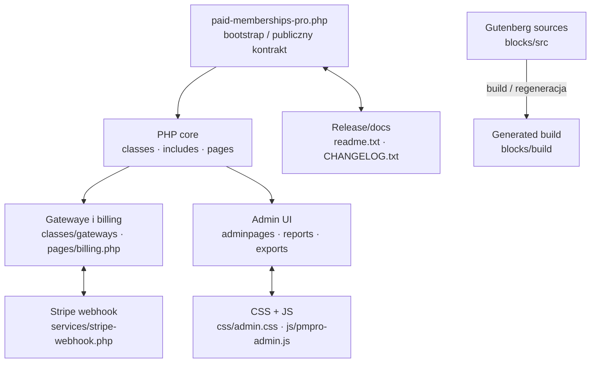

# Mapa repozytorium

## TL;DR

To duży, legacy’owy plugin WordPress/Paid Memberships Pro: rdzeń PHP uruchamia plugin i spina billing, gatewaye, administrację, eksporty oraz ograniczanie dostępu, a JavaScript i bloki Gutenberg dostarczają UI. Największa aktywność w ostatnim roku skupiała się wokół `classes/email-templates`, `blocks/build` i `includes/lib`, ale dwa pierwsze obszary są częściowo generowane lub powtarzalne; najbardziej hands-on są gatewaye, billing, raporty, eksporty, pliki ograniczone i webhook Stripe. Edytory bloków mają czysty, płytki graf importów bez wykrytych cykli, lecz adminowy JavaScript jest poza tym grafem i zależy od globalnego DOM, jQuery, `window` i `wp`. Najbardziej realne granice zmiany przebiegają między bootstrapem/releasem, płatnościami, panelem administracyjnym oraz blokami checkoutu i kontroli widoczności. Największe ryzyko leży na granicach, nie w samych katalogach: gateway ↔ webhook, CSS ↔ JS, PHP ↔ globalny admin UI i źródła bloków ↔ wygenerowany build. Autorstwo wskazuje przede wszystkim Davida Parkera jako kontakt przekrojowy, Dale’a Mugforda i Kim Coleman dla admina oraz Davida Wanjukiego dla bloków.

## Teren

### Gdzie żyje odpowiedzialność

- **Rdzeń i przekroje:** `paid-memberships-pro.php`, `includes/`, `classes/`, `pages/`. Tu spotykają się ładowanie, funkcje wspólne, modele/usługi pluginu i ekrany przepływów użytkownika.
- **Płatności:** `classes/gateways/`, `pages/billing.php`, `services/stripe-webhook.php`. To granica synchronicznego requestu, danych billingowych i asynchronicznego webhooka.
- **Administracja:** `adminpages/`, `adminpages/reports/`, `classes/class-pmpro-exports.php`, `js/pmpro-admin.js`, `css/admin.css`.
- **Bloki:** ręcznie czytane źródła są w `blocks/src/`; `blocks/build/` jest wynikiem budowania, nie równorzędnym miejscem projektowania.
- **Peryferia i kontrakt wydawniczy:** `readme.txt`, `CHANGELOG.txt`, biblioteki w `includes/lib`, szablony e-maili i artefakty tłumaczeń.

### Głębokość i aktywność

`classes/`, `includes/` i admin są modułami głębokimi: wiele funkcji przechodzi przez wspólne punkty PHP, eksporty lub ekrany. Bloki Gutenberg są bardziej płytkie i lokalne w grafie importów, ale wymagają kontekstu WordPress/Gutenberg. `classes/email-templates`, `blocks/build` i `includes/lib` są wysokie w rankingu aktywności, lecz część tej pracy wynika z regeneracji, bibliotek lub zmian powtarzalnych, więc nie należy traktować samych liczników jako głębokości odpowiedzialności.

W oknie 2025-08-30–2026-08-30 było 562 widocznych commitów: szczyt przypadł na 2026 Q1 (204), po szerokiej aktywności w Q4 2025 (148); Q3 2025 i Q3 2026 są niepełne. Najaktywniejsze pliki to bootstrap, dokumentacja wydania, adminowy JS/CSS, addony, eksporty, billing i Stripe gateway.

## Realne powiązania

| Powiązanie | Warstwa | Skąd wiadomo | Rodzaj sprzężenia |
|---|---|---|---|
| `paid-memberships-pro.php` ↔ `readme.txt` ↔ `CHANGELOG.txt` | bootstrap / release | historia Gita: odpowiednio 24, 23 i 32 wspólne commity | ręczne zmiany kontraktu i release; część aktywności dokumentacyjna |
| `css/admin.css` ↔ `js/pmpro-admin.js` | admin UI | historia Gita: 12 wspólnych commitów | ręczna zmiana zachowania i prezentacji; graf importów tego nie obejmuje |
| `classes/gateways` ↔ `services/stripe-webhook.php` | płatności / usługi | historia Gita: 5 wspólnych commitów | ręczne sprzężenie integracyjne; PHP nie było analizowane dependency-cruiserem |
| `blocks/src/*` ↔ komponenty Gutenberg | frontend bloków | graf importów: 94 moduły, 129 zależności, 0 cykli | jawne importy; testy wymagają mocków/kontekstu Gutenberg |
| `blocks/src` → `blocks/build` | źródła / artefakt | struktura repo i opis aktywności | regeneracja/build, nie ręczna współedycja; tani i odtwarzalny koszt, ale ryzyko błędnego publikowania artefaktu |
| `js/pmpro-admin.js` ↔ PHP/admin DOM | admin / runtime WordPressa | **unknown w grafie**: narzędzie nie modeluje globalnego DOM, jQuery, `window` ani `wp` | nie wolno wnioskować o braku zależności; potrzebny test DOM/integracyjny lub e2e |

Graf importów obejmuje tylko `blocks/src/**/*.js` i `js/**/*.js`, nie PHP ani `blocks/build`. Brak krawędzi dla PHP, runtime WordPressa i adminowego JS oznacza `unknown`, a nie brak powiązań. Cykli nie wykryto w objętym grafem JS; nie jest to twierdzenie o całym repozytorium.

## Strefy ryzyka

1. **Gatewaye, billing i Stripe webhook** — błąd na granicy request/webhook może rozjechać stan płatności, kwoty lub autoryzację endpointu.
2. **Admin UI: CSS, JS i PHP** — zachowanie jest rozproszone między DOM-em WordPressa, globalami i stylami, których graf importów nie widzi.
3. **Checkout Gutenberg** — `checkout-page/edit.js` i `checkout-button/edit.js` mają wiele zależności Gutenberg, więc izolowane testy łatwo dają fałszywe poczucie bezpieczeństwa.
4. **Content visibility** — `content-visibility-controls.js` jest współdzielonym punktem wpływu dla kilku edytorów i wymaga testu jednostkowego oraz integracyjnego.
5. **Bootstrap i release** — zmiana głównego pliku często idzie z dokumentacją, deprecjacjami i wymaganiami PHP; łatwo naruszyć publiczny kontrakt.
6. **Generowane artefakty** — `blocks/build`, szablony e-maili, `includes/lib` i tłumaczenia mogą zmieniać się masowo przez regenerację, zaciemniając realny zakres ręcznej zmiany.

## Kogo zapytać

| Strefa | Pierwszy kontakt | Drugi kontakt |
|---|---|---|
| Gatewaye / Stripe | David Parker | Flint (Stripe Connect), Andrew Lima (Billing Portal) |
| Admin UI | Dale Mugford (JS i przepływy) | Kim Coleman (CSS, responsywność, dostępność) |
| Checkout Gutenberg | David Wanjuki | opiekun architektury bloków nie wynika jednoznacznie z historii |
| Content visibility | David Wanjuki | Andrew Lima (prezentacja), David Parker (zachowanie) |
| Bootstrap / release | David Parker | Dale Mugford (hooki, auto-update, background jobs) |

To są kandydaci na support na podstawie aktywności commitowej, nie formalni właściciele modułów.

## Pierwszy dzień

Czytaj w tej kolejności — od granicy wejścia do miejsc o największym koszcie pomyłki:

1. `paid-memberships-pro.php` — kolejność ładowania i punkty wejścia pluginu.
2. `includes/functions.php` — wspólne funkcje i przekrojowe założenia PHP.
3. `pages/billing.php` — przepływ billingowy od strony aplikacji.
4. `classes/gateways/class.pmprogateway_stripe.php` — kontrakt gatewaya Stripe.
5. `services/stripe-webhook.php` — asynchroniczna druga połowa integracji płatniczej.
6. `js/pmpro-admin.js` razem z `css/admin.css` — realny, niewidoczny w grafie kontrakt admin UI.
7. `blocks/src/checkout-page/edit.js` — najgłębszy punkt wejścia do checkoutu Gutenberg.
8. `blocks/src/component-content-visibility/content-visibility-controls.js` — współdzielony punkt wpływu bloków.

## Ograniczenia

Mapa opisuje aktywność i strukturę w oknie jednego roku (2025-08-30–2026-08-30), a nie pełną historię ani aktualny formalny ownership. Liczniki Gita mówią o commitach dotykających plików, nie o rozmiarze ani trudności zmian; merge commity są uwzględnione w aktywności, autorzy kontaktowi pochodzą z historii bez merge. Dependency-cruiser objął tylko JavaScript (`blocks/src` i `js`), więc PHP, runtime WordPressa, DOM/globalne zależności i wygenerowany build pozostają poza grafem; tam brak krawędzi jest `unknown`. Wysoka aktywność `blocks/build`, `classes/email-templates`, `includes/lib` i tłumaczeń może wynikać z regeneracji lub powtarzalnego procesu, nie z ręcznej pracy nad każdym plikiem. Mapa nie dowodzi kompletności testów, jakości kodu, kolejności runtime ani tego, że wskazany kontrybutor jest obecnym właścicielem.
